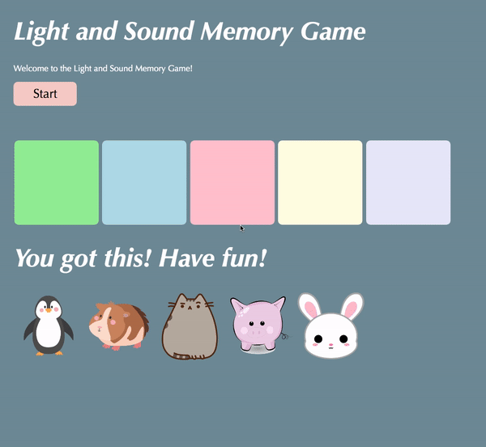

# Pre-work - *Memory Game*

**Memory Game** is a Light & Sound Memory game to apply for CodePath's SITE Program. 

Submitted by: **Abigail Batinga**

Time spent: **6** hours spent in total

Link to project: https://eager-caring-boat.glitch.me/

## Required Functionality

The following **required** functionality is complete:

* [x] Game interface has a heading (h1 tag), a line of body text (p tag), and four buttons that match the demo app
* [x] "Start" button toggles between "Start" and "Stop" when clicked. 
* [x] Game buttons each light up and play a sound when clicked. 
* [x] Computer plays back sequence of clues including sound and visual cue for each button
* [x] Play progresses to the next turn (the user gets the next step in the pattern) after a correct guess. 
* [x] User wins the game after guessing a complete pattern
* [x] User loses the game after an incorrect guess

The following **optional** features are implemented:

* [x] Any HTML page elements (including game buttons) has been styled differently than in the tutorial
* [ ] Buttons use a pitch (frequency) other than the ones in the tutorial
* [x] More than 4 functional game buttons
* [x] Playback speeds up on each turn
* [x] Computer picks a different pattern each time the game is played
* [x] Player only loses after 3 mistakes (instead of on the first mistake)
* [x] Game button appearance change goes beyond color (e.g. add an image)
* [ ] Game button sound is more complex than a single tone (e.g. an audio file, a chord, a sequence of multiple tones)
* [ ] User has a limited amount of time to enter their guess on each turn

The following **additional** features are implemented:

- [x] Added caption replacing welcome message that shows directions when game starts
- [x] Added a display of attempts left

## Video Walkthrough

Here's a walkthrough of implemented user stories:

## Reflection Questions
1. If you used any outside resources to help complete your submission (websites, books, people, etc) list them here. 
- https://stackabuse.com/javascript-generate-random-number-in-range/
- https://www.w3schools.com/js/js_output.asp 
- https://pnghut.com/ 
- https://pngtree.com/ 
- https://www.w3schools.com/tags/tag_img.asp 
- https://www.geeksforgeeks.org/how-to-change-an-input-button-image-using-css/ 
- https://www.w3schools.com/howto/howto_css_images_side_by_side.asp 
- Note: all images used were Royalty Free

2. What was a challenge you encountered in creating this submission (be specific)? How did you overcome it? (recommended 200 - 400 words) 

One challenge I encountered occurred when I tried to implement the fourth optional feature: “Give the player 3 strikes.” I understood where to place the logic for handling when a mistake was made but I ran into an issue where the next pattern in the sequence was played after a mistake rather than the one the user just did incorrectly.

I realized that it made more sense for the user to be able to repeat the same pattern they’d done incorrectly before proceeding to the next part of the pattern, but I struggled to figure out where my issue was. 

To solve this, I utilized the console as described in the tutorial. I printed out the variables that were being modified during a guess such as progress and the amount of mistakes made. I made a hypothesis that my issue was due to the progress variable being modified incorrectly, and tested out this hypothesis by purposely playing a game where I made multiple mistakes and watching the values in the console. After doing this, I was able to verify my hypothesis by seeing that the progress variable was being incorrectly incremented. 

Another difficulty I had with implementing this feature was in displaying the amount of tries the user had left. I wanted to display this as an HTML element but also add a variable that would be updated through the script.js file. At first, I felt lost about how to connect these two components, but I went back to the document.getElementById() method and decided to view the documentation and check the available methods I could call on a HTML element. Through this, I learned about Element.innerHTML and taught myself how to display a dynamic JavaScript variable through an HTML element. 

3. What questions about web development do you have after completing your submission? (recommended 100 - 300 words) 

Throughout this pre-work assignment, I was curious about many aspects of web development such as saving data, privacy, accessibility, and efficiency. One of the main questions I have about web development is: how can we improve the security and privacy of an application or website published to the web?

If for example, this game had included the option to enter one’s name or email address, what methods would be necessary to 1. Save this data, and 2. Protect this data. Web applications in particular have a very unique responsibility because usually they handle sensitive data, so what measures can a developer take to make sure this data is protected?

Another question I have is regarding efficiency. How can we design web applications or websites to have efficient interactions with the user. For example, a website that takes very long to load or to process some type of user input would cause a negative experience for the user. So what types of design considerations must be made with the assets as well as the back-end in order to make sure the website is not only robust but also runs in a timely manner for the user?

Along with these questions, I also want to know: how can we make websites or applications more accessible? For example, I know HTML images provide the option for alt text, which is useful to those who use screen reader software to listen to the contents of a website. But beyond this, what web development practices such as the design of a button, color choices, or headers, can help make a site more accessible to those with certain impairments or disabilities?

4. If you had a few more hours to work on this project, what would you spend them doing (for example: refactoring certain functions, adding additional features, etc). Be specific. (recommended 100 - 300 words) 

If I had a few more hours to work on this project, I would improve functions such as playClueSequence() and add additional features to encourage users to keep playing. 

One thing I noticed as I was playing the game was that users are still able to click the buttons while the clue sequence is playing. Although it is inferred that the user should wait for the clue sequence to finish playing before clicking any buttons, it is still possible they might do so, and when they do, unwanted behavior is produced. If possible, I’d want to modify the playClueSequence() method to restrict users from clicking buttons until the clue sequence is finished playing. If this isn’t possible, I could also add a message that shows up for as long as the sequence is playing to inform users not to begin replicating the pattern yet.

In terms of additional features, I’d want to provide opportunities to make the game more challenging and potentially collaborative. For example, there could be a feature that includes multiple levels, where difficulty is increased by the speed of the clue sequence playback and the number of memory buttons. For collaboration, it’d be interesting to have a multiplayer option where users see who can complete the entire pattern faster. To increase retention, it would be great if users could see their progress in various sessions, where we keep a score based on how many patterns were done correctly, and they are notified if they’ve beaten their last saved high score.

## License

    Copyright Abigail Batinga

    Licensed under the Apache License, Version 2.0 (the "License");
    you may not use this file except in compliance with the License.
    You may obtain a copy of the License at

        http://www.apache.org/licenses/LICENSE-2.0

    Unless required by applicable law or agreed to in writing, software
    distributed under the License is distributed on an "AS IS" BASIS,
    WITHOUT WARRANTIES OR CONDITIONS OF ANY KIND, either express or implied.
    See the License for the specific language governing permissions and
    limitations under the License.
